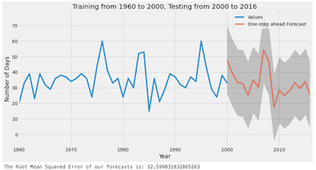

# UK Climate Analysis

This examle is selected to provide a more realistic training model, using large climatic datasets and some machine learning methods:

The code has been adapted from this repo:
https://github.com/aamirpatel23/UK-Climate-Analysis

All of the work on the model is the work of Aamir Patel:
https://github.com/aamirpatel23

The model uses historical data about temperature, rainfall, sunshine and
snowfall, used to predict the future of the climate in the UK over the next 40 years.



There have been various changes made to the original code to make it more usable and readable in DAFNI.

A Dockerfile has also been added so that the model can run in a container.

## Datasets required
The model is based on climate projection data from UKCP09 which is downloadable from CEDA (you will need a free account to access and download the data from CEDA). The datasets needed to run the model for all feature types are listed below:

• https://data.ceda.ac.uk/badc/ukcp09/data/gridded-land-obs/gridded-land-obs-daily/grid/ascii/maximum-temperature

• https://data.ceda.ac.uk/badc/ukcp09/data/gridded-land-obs/gridded-land-obs-daily/grid/ascii/rainfall

• https://data.ceda.ac.uk/badc/ukcp09/data/gridded-land-obs/gridded-land-obs-monthly/grid/ascii/snow-lying

• https://data.ceda.ac.uk/badc/ukcp09/data/gridded-land-obs/gridded-land-obs-monthly/grid/ascii/sunshine

Note, these datafiles are large, but fortunatelyy they have already been loaded into DAFNI, so with the appropriate group permissions (just ask us first) you can access them directly (by 'UID') so as to save your own disk space.

If you want to test the model locally, you will still need to download the files from CEDA and file them in your folder structure (noting each of these is a zip file, thus in /data/inputs/rainfall you would have 'rainfall.zip' etc.).

## A note on data files
In DAFNI, the general concept is to upload your datafiles to the system as a separate action. The interface has a 'Data' option to allow this. Your model then operates on this data. You can hold your own datafiles privately, or share them with others. One real strength of DAFNI is the ability to access datasets already provided within the platform in your models, removing a lot of the work you might have had to do. Data has 'metadata' associated with it to help you find what you want. Data is also uniquely identified by a 'UID'. When you upload a dataset, the UID is generated automatically for you. You can then use this UID in the yaml file, in the dataslots section to reference the file.

## Creating the DOCKER container
After installing Docker on your computer, below are the commands you will need to run to create your docker image of the model ready to upload to DAFNI.
See https://docs.secure.dafni.rl.ac.uk/docs/how-to/models/how-to-create-a-dafni-ready-model/. This is assuming you have downloaded the model files from this git repository to a local working folder on a computer with docker installed. Change directory to the uk-climate-analysis folder, and from the command prompt/terminal, type:

### Build container
To construct the docker file
`docker build -t uk-climate-analysis .`

### Run container
If you want to run the docker file to test it. Note this step is not necessary for loading into DAFNI.
`docker run uk-climate-analysis`

### Build image
You then create a binary image file of the model, ready to upload to DAFNI.
`docker save -o uk-climate-analysis.tar uk-climate-analysis`

### Compress resultant tar image
DAFNI allows you to compress the binary file before uploading, handy if the file is large.
`gzip uk-climate-analysis.tar`

This compressed gz file, and the yaml file can now be uploaded to DAFNI via the DAFNI web interface at .

## Visualising the Model Output
When you run the model, a series of output data files are created. The `visualisation.py` script is used to graph these. This assumes you have the output data available to a Jupyter notebook. If needed, you can adapt the `get_output_folder()` function to point to a different output folder instead.

In the DAFNI workflow, configure a visualisation to bring over all the data from the model run from path `/data/outputs/*` (this is added in the workflow visualisation setting right at the end of the configuration, below all the metadata settings).

In DAFNI, create a new 'Jupyter notebook' in the visualisation tool and then copy and paste in the Python code from the `visualisation.py` file. When you run this, you should see the graphs appear (may take a few moments to run).

## Running the model locally in stand-alone mode
Running the model locally, rather than in DAFNI follows a different mechanism. In DAFNI, note the `Dockerfile` provided contains the following two lines:

```
RUN pip install -r requirements.txt
CMD python climate_analysis.py
```

So in DAFNI the model file (climate_analysis.py) is run automatically by the workflow model. However, if you want to run this on your computer stand-alone, first install the requirements:
```
pip install -r requirements.txt
```

Then, change the `OUTPUT_FOLDER` and `INPUT_FOLDER` in the `climate_analysis.py` file to match your actual data folders. Note you will have to hold the datafiles locally also. Then, to run the model:

```
python climate_analysis.py
```
